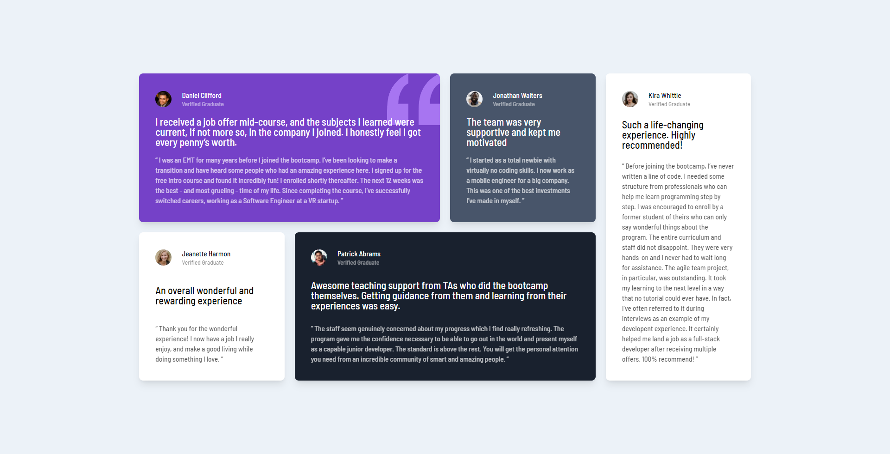

# Frontend Mentor - Testimonials grid section solution

This is a solution to the [Testimonials grid section challenge on Frontend Mentor](https://www.frontendmentor.io/challenges/testimonials-grid-section-Nnw6J7Un7). Frontend Mentor challenges help you improve your coding skills by building realistic projects.

## Table of contents

- [Frontend Mentor - Testimonials grid section solution](#frontend-mentor---testimonials-grid-section-solution)
  - [Table of contents](#table-of-contents)
  - [Overview](#overview)
    - [The challenge](#the-challenge)
    - [Screenshot](#screenshot)
    - [Links](#links)
  - [My process](#my-process)
    - [Built with](#built-with)
    - [What I learned](#what-i-learned)
  - [Author](#author)

## Overview

### The challenge

Users should be able to:

- View the optimal layout for the site depending on their device's screen size

### Screenshot



### Links

- Solution URL: [Add solution URL here](https://github.com/pexeixv/frontendmentor/testimonials)
- Live Site URL: [Add live site URL here](https://fem.gavinpereira.in/testimonials)

## My process

### Built with

- Semantic HTML5 markup
- CSS custom properties
- Flexbox
- CSS Grid
- Mobile-first workflow
- TailwindCSS

### What I learned

```html
<!-- Utility classes foe Grid row/col start/end/span properties in Tailwind -->
<div class="row-start-1 row-end-3 col-span-2">...</div>
```

## Author

- Website - [Gavin Pereira](https://gavinpereira.in)
- Frontend Mentor - [@pexeixv](https://www.frontendmentor.io/profile/pexeixv)
